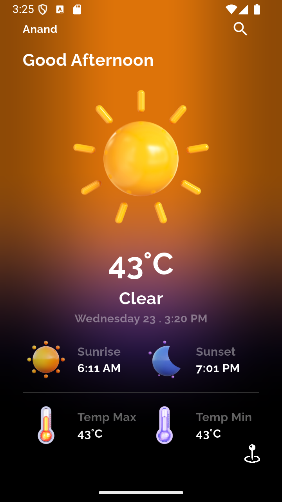
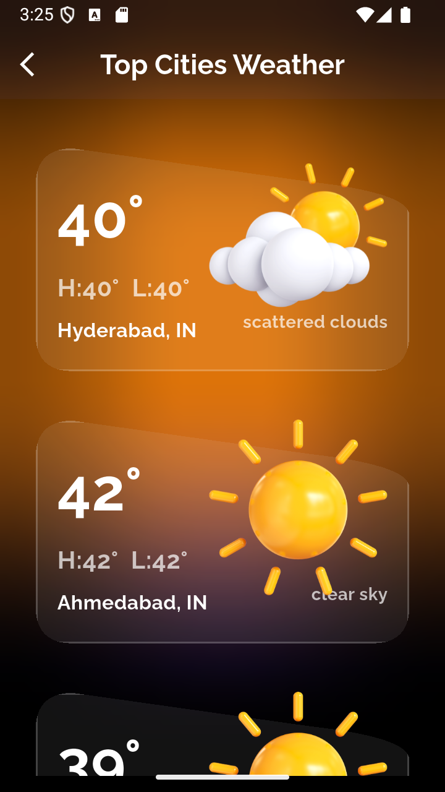
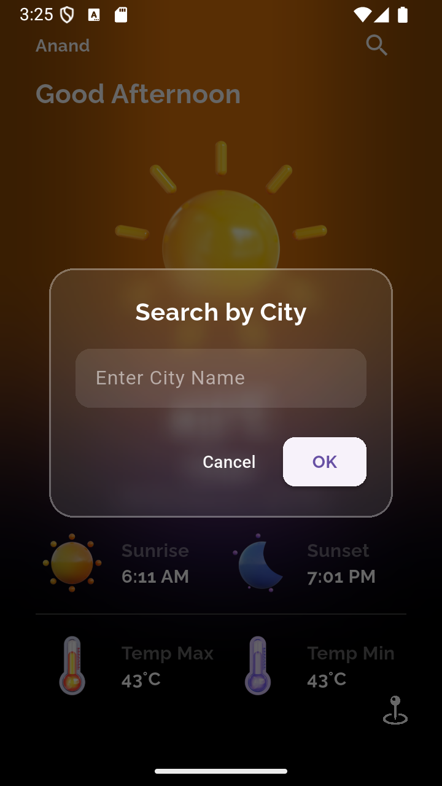

---

# 🌦️ Weather App

A beautiful **Flutter** weather application that delivers real-time weather updates using your current location or a curated list of global cities. The app is designed with **modern UI principles**, powered by **glassmorphism**, and built on robust **state management** with `flutter_bloc`.


---
## 📸 Images

Here’s how the app looks:

| Home Screen                  | Top Cities Forecast             | Search Weather By City             |
|-----------------------------|----------------------------------|----------------------------------|
|        |          |            |

---

---


## 🚀 Features

- 📍 **Location-Based Weather**  
  Automatically detects your current location and displays real-time weather updates.

- 🌆 **Top Cities Forecast**  
  View weather forecasts for a list of popular cities around the world.

- 🌤️ **Detailed Weather Info**  
  Includes current temperature, highs/lows, weather conditions, icons, and more.

- 🛑 **Permission Handling**  
  Graceful handling of location permission requests, denials, and errors.

- 🧠 **State Management with `flutter_bloc`**  
  Clean architecture and reactive UI updates.

- 💎 **Modern, Glassmorphism UI**  
  Eye-catching design with translucent UI elements for a premium feel.

---

## 🧰 Tech Stack

| Technology     | Purpose                                    |
|----------------|---------------------------------------------|
| **Flutter**     | Cross-platform mobile development            |
| `flutter_bloc` | Efficient and scalable state management      |
| `geolocator`   | To get the user's GPS location               |
| Weather API    | To fetch accurate real-time weather data     |
| `BackdropFilter` | For glassmorphism-style blurred backgrounds |

---

## 📁 Project Structure

```plaintext
lib/
├── bloc/                 # Weather BLoC logic
│   └── weather_bloc_bloc.dart
│   └── weather_bloc_event.dart
│   └── weather_bloc_state.dart
├── screens/              # App screens
│   ├── home_page.dart
│   └── top_cities_weather.dart
├── ui/                   # UI helpers & components
│   └── helper.dart
└── main.dart             # App entry point
```

---

## 🛠️ Setup Instructions

### ✅ Prerequisites

- Install **Flutter SDK**: [Installation Guide](https://flutter.dev/docs/get-started/install)
- A suitable code editor: VS Code / Android Studio

### 📦 Install Dependencies

```bash
flutter pub get
```

### 🔐 Configure the Weather API

1. Get an API key from [WeatherAPI](https://www.weatherapi.com/)
2. Add the key to your configuration file or directly in the request (secure storage recommended).

---

## ▶️ Running the App

1. **Clone the repo**:
   ```bash
   git clone https://github.com/Piyush1716/flutter_weather_bloc.git
   cd flutter_weather_bloc
   ```

2. **Install packages**:
   ```bash
   flutter pub get
   ```

3. **Run the app**:
   ```bash
   flutter run
   ```

> Make sure your device or emulator is running and location services are enabled.

---

## 🧩 Code Walkthrough

### 🌍 Location + Permissions

- Uses `Geolocator` to get current coordinates.
- Handles permissions gracefully (prompt, denied, or errors).
- Triggers weather data fetch on location retrieval.

### 📡 State Management with `flutter_bloc`

- Events trigger API calls and update state.
- `BlocBuilder` listens to state changes to rebuild UI dynamically.
- Separates UI logic from business logic for clean codebase.

### 🏙️ Top Cities Forecast

- Displays city weather in a `ListView`.
- Each weather card uses `BackdropFilter` for a frosted-glass style.

---


